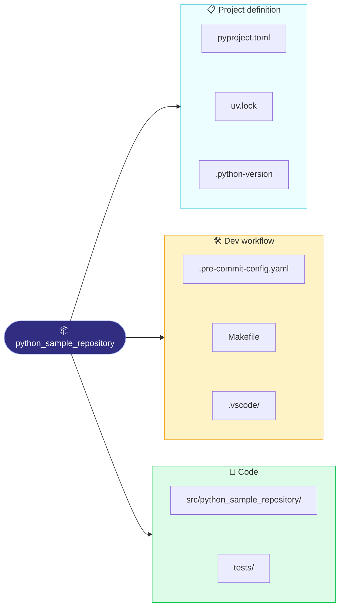
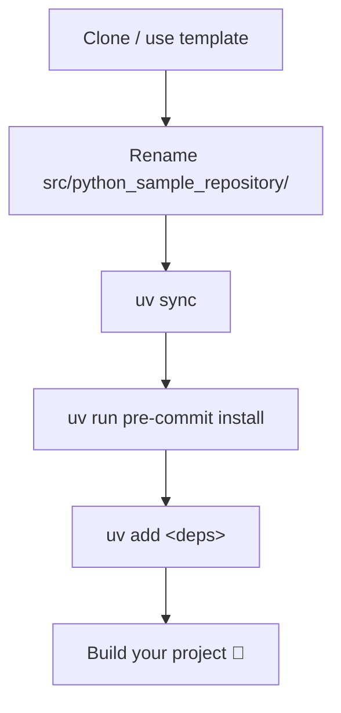

# Sample Python Project

A lean, well-structured starting point for any Python project. It ships the
tooling and conventions you'd otherwise set up by hand, with **no runtime
dependencies of its own** - add what each project needs with `uv add`.

## Project layout

## What's included

| File / directory                | Purpose                                                         |
| ------------------------------- | --------------------------------------------------------------- |
| `.python-version`               | Pins the Python version (3.14.6); uv installs it on demand.     |
| `pyproject.toml`                | Project metadata, the `ruff` lint/format config, and dev group. |
| `uv.lock`                       | Fully resolved dependency lock. See `SETUP.md`.                 |
| `.pre-commit-config.yaml`       | Shared code standards enforced before each commit.              |
| `src/python_sample_repository/` | Package source, laid out under a `src/` directory.              |
| `tests/`                        | pytest test suite.                                              |
| `.vscode/`                      | Workspace settings and recommended extensions.                  |
| `SETUP.md`                      | How to install, run, and manage dependencies.                   |

## Tooling

| Tool                                              | Role                              | Where it's configured       |
| ------------------------------------------------- | --------------------------------- | --------------------------- |
| [uv](https://docs.astral.sh/uv/)                  | Python, venv & dependency manager | `pyproject.toml`, `uv.lock` |
| [ruff](https://docs.astral.sh/ruff/)              | Linter & formatter                | `[tool.ruff]`               |
| [ty](https://docs.astral.sh/ty/)                  | Type checker                      | `[tool.ty.environment]`     |
| [pytest](https://docs.pytest.org/)                | Test runner                       | `[tool.pytest.ini_options]` |
| [pre-commit](https://pre-commit.com/)             | Git hook orchestration            | `.pre-commit-config.yaml`   |
| [ipykernel](https://github.com/ipython/ipykernel) | Jupyter notebook kernel           | dev dependency group        |

## Using this as a template

1. Rename the package: `src/python_sample_repository/` and the `name` / `[project.scripts]`
   entries in `pyproject.toml`.
1. Add your dependencies with `uv add <package>`.
1. Follow `SETUP.md` to set up the environment and pre-commit hooks.
